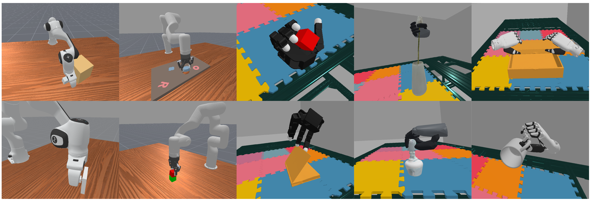

<!-- PROJECT LOGO -->

<p align="center">

<h1 align="center">
  <br>
  <em>ImVR</em>: Immersive VR Teleoperation System for General Purpose</em>
</h1>

<div align="center">
<a href='https://liuyulinn.github.io/imvr.github.io/'></a>
<a href='https://openreview.net/pdf?id=26wkb05i8h'></a>
<a href='https://liuyulinn.github.io/imvr-doc/'></a>
</div>
<p align="center">
  <a href="https://liuyulinn.github.io/">Yulin Liu</a><sup>*</sup>,
  <a href="https://alan-heoooh.github.io/">Zihao He</a><sup>*</sup>,
  <a href="https://www.fbxiang.com/">Fanbo Xiang</a><sup>*</sup>,
  Runlin Guo,
  <a href="https://sites.google.com/view/zhiao-huang">Zhiao Huang</a>,
  Jialin Zhang,
  <a href="https://albertboai.com/">Bo Ai</a>,
  <a href="https://www.stoneztao.com/">Stone Tao</a>,
  <a href="https://cseweb.ucsd.edu/~haosu/">Hao Su</a>

<p align="center">                                                                                                        
    
</p>                                                                                                                      


## 🔧 Installation and Usage

For detailed installation and usage
instructions, please refer to our [documentation](https://liuyulinn.github.io/imvr-doc/).

## 🎉 News

- [2026/4/22] Beta release! Includes basic usage of teleoperation in ManiSkill. Check out
  the [documentation](todo).

* [2025/6/25] Presented our work at the [RSS-Dex](https://dex-manipulation.github.io/rss2025/) Workshop!
* [2025/6/21] We show live VR teleoperation demos with ManiSkill at the ManiSkill booth in [RSS](https://roboticsconference.org/)! Most participants (95%+) successfully completed the challenging “grasp-and-insert flower into vase” task on their first try!

## ✅ TODO

- [X] Tutorial for basic usage
- [X] Release code for single arm gripper & hand teleoperation in ManiSkill
- [ ] Release code for bimanual teleoperation in ManiSkill
- [ ] Release real world teleoperation code

## 🤗 Citation

```
@inproceedings{liuimvr,
title={ImVR: Immersive VR Teleoperation System for General Purpose},
  author={Liu, Yulin and He, Zihao and Xiang, Fanbo and Guo, Runlin and Huang, Zhiao and Zhang, Jialin and Ai, Bo and Tao, Stone and Su, Hao},
  booktitle={3rd RSS Workshop on Dexterous Manipulation: Learning and Control with Diverse Data}
}
```

If you have any question, please feel free to mail `yul266@ucsd.edu`.
